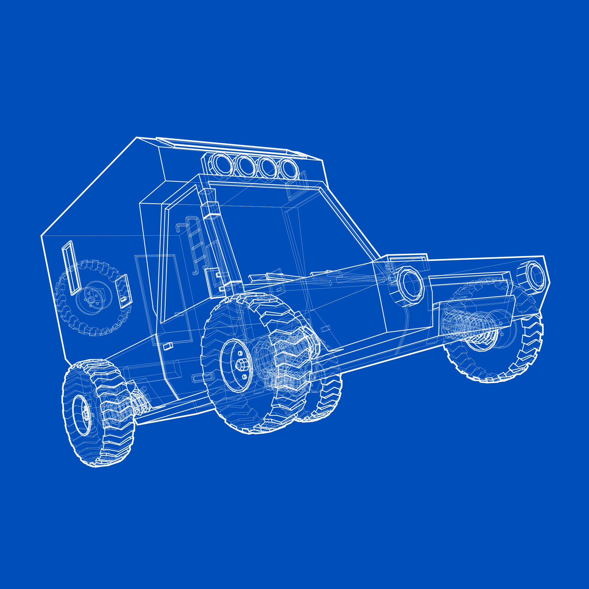

# 矢量渲染器VecRender v0.1
A truly vector-based 3D model render, which can output vector image.

作者：impesx
邮箱：impesx@gmail.com

## 使用方法：
首先把要渲染的obj模型文件存放于3D_Files文件夹中并命名为model.obj。然后打开exe文件，会出现一个命令行窗口与一个图形窗口。图形窗口中左侧为模型的当前渲染模式下的渲染效果（默认为4），右侧为模型线框图（供参考）。鼠标左键旋转模型，右键移动模型，滚轮缩放。命令行输入命令后需按enter确认。

渲染模式 | 说明
:--:| ----
0 | 线框图（模型所有三角面的边）
1 | 线段图
**2**| **区分了属性的线段图（轮廓线、顶层线段、底层线段）**
3 | 使用传统渲染引擎渲染的线稿效果（并非采用矢量渲染算法）
4 | 实体渲染（颜色为法线方向）
5 | 表现了深度及线段的实体渲染
6 | 实体渲染（无颜色）
7 | 顶点图
8 | 彩色顶点图（颜色代表深度）

**仅在渲染模式1、2下能输出svg，其他模式不可输出或输出会出错。
查看渲染模式1~5需要先在命令行执行e命令生成edge。**

**复杂模型渲染时间较长，且每次改变模型位置后会重新渲染，建议先用较快的渲染模式（如0、4）确定好模型位置后再输出输出矢量图。**

## 命令行命令说明：
单命令：

e：计算edge

svg：输出当前视图的渲染结果

o：切换透视视图、正交视图

**output：相当于命令e、t 2、svg三者的组合，用于快速出图**

带参数的命令：

t var：指定渲染模式

c var：指定折叠角（若两个面相交但夹角小于折叠角，其交线不会被视为edge）

以下功能也可用鼠标完成

s var：指定缩放参数var

rx var：模型x方向的旋转角度

ry var，rz var 同上

cz var：相机距离

x var：模型x位置偏移

y var，z var 同上

本人时间能力有限，bug在所难免，算法优化也不到位，欢迎交流。

